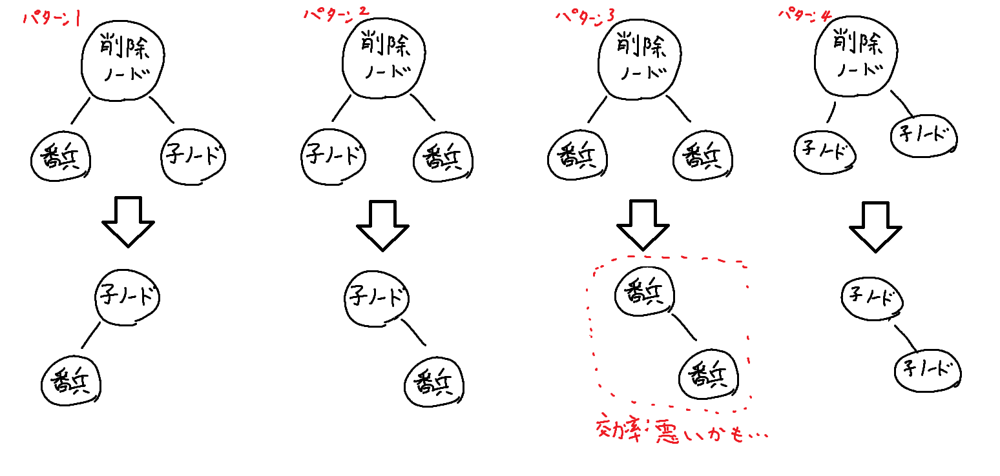

# AVL木のページ

## 概要
ノードの左右の部分木の高さの絶対差が1以内であるようにする。  
絶対差が2以上発生するようなケース(二分探索木の最悪ケース)の場合は<b>木の回転</b>で対応する。  
実装上の工夫であるが、各ノードにはデフォルトで高さが0の番兵を追加し、左右に子ノードが無くても部分木の高さの絶対差を計算できるようにしている。  
各ノードの高さは左右の部分木の高さの最大値+1とする。  

|  処理  |  計算量  |
| ---- | ---- |
|  追加  | O(logN)  |
|  削除  | O(logN)  |
|  検索  | O(logN)、この実装では辞書に入れてるのでO(1)  |
|  二分探索  | O(logN) |

  

## 用途
データが逐次追加されるような状況で二分探索が必要な時。  
SortedSetと同じぐらい速かったよ。

  

## 処理概要

### 追加 
根のノードから以下を行う。
追加したい値をVとする。  

1. 自分のノードに含まれる値 <= Vなら左のノードへ遷移する。もし、遷移先が無ければそこに新しいノードを追加する。  
2. そうでなければ右のノードへ遷移する。もし、遷移先が無ければそこに新しいノードを追加する。  

追加のロジックは普通の二分木と同じ。  
追加したノードを含む木の高さを反映させ、バランスが崩れていないかを判定する。崩れていた場合、木の回転を行いバランス調整を行う。

  

### 削除 
根のノードから以下を行う。
削除したい値をVとする。  

削除したい値が見つかるまで以下を行う.もし見つからなかったら終わり。アルゴリズムからの要望はないので好きな処理にしてね。
1. 自分のノードに含まれる値 <= Vなら左のノードへ遷移する。もし、遷移先が無ければそこで終わり。  
2. そうでなければ右のノードへ遷移する。もし、遷移先が無ければそこで終わり。  
3. 削除したい場所に辿り着いたら以下の分岐に入る。　 

#### 削除パターン
AVL木で番兵を追加しているので、「子ノードがない時」は存在せず、全て子ノードが2つある状態になっていることに注意。あと回転が実装されているため、削除前のタイミングで左右の部分木の高さの絶対差が2以上になってもいない。

削除ノードから1つ右遷移(削除パターンの条件から必ずある)し、その後、左側に行けるだけ行く。
辿り着いたノードと削除ノードを取り替える。  
※1つ左に遷移した後辿れるだけ右に遷移したものと取り替えても別に問題ない。  
念のため、削除パターンを画像で列挙する

削除後、削除したノードを含む木のバランスが崩れる可能性があるため、チェックし崩れていたら回転でバランスを整える

参考サイト:(というか番兵とか回転とかまんま真似しました)
・http://wwwa.pikara.ne.jp/okojisan/avl-tree/iavl-tree.html

  

